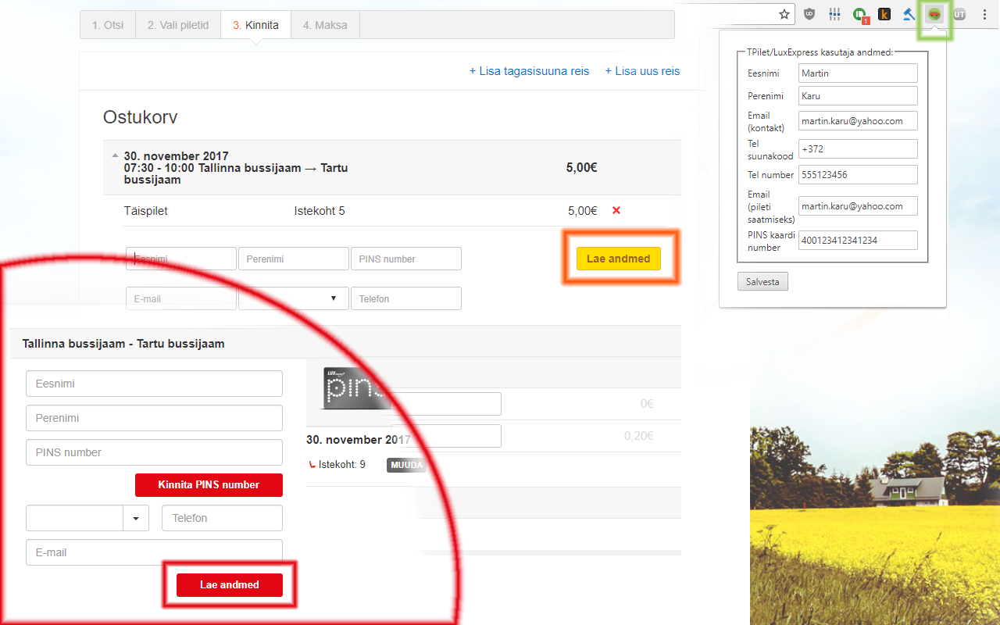

## TPilet ja LuxExpress andmesisestaja
Laiendus automatiseerib tpilet.ee ja luxexpress.eu keskkondadest bussipileti ostmisel andmete (sh nt PINSi numbri) sisestamist, luues selleks ostukorvidesse uue nupu "Lae andmed". Enda andmed saad sisestada pärast laienduse lisamist ülal paremalt rohekast bussi pildiga ikoonist. Andmed seotakse sisselonginud kasutaja Google kontoga. Edaspidi saad neid kõigist enda arvutitest lisada pileti ostmisel ühe nupuvajutusega.

Hetkel on toetatud vaid ühe kasutaja lisamine ja muutmine (st hetkel ei saa mällu lisada kahte või enamat kasutaja).

## Näidispilt

